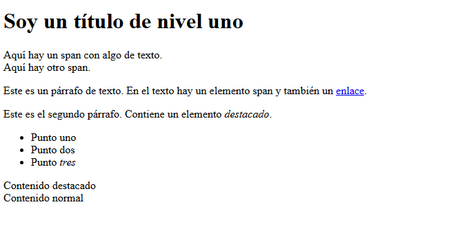
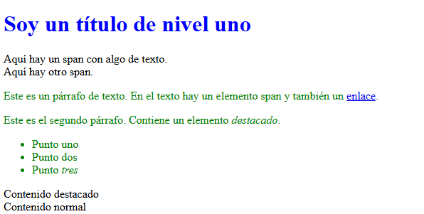
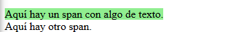
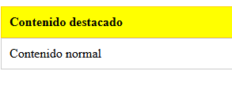
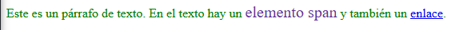

# 🎨 CSS

CSS (Cascading Style Sheets - en español Hojas de Estilo en Cascadas) es usado para darle estilo y diseño a las páginas Web — por ejemplo, para cambiar la fuente de letra, color, tamaño y el espaciado de tu contenido; dividir en múltiples columnas, o agregar animaciones y otras propiedades decorativas.

Una _regla CSS_ es una estructura que agrupa un selector y un conjunto de propiedades con sus respectivos valores, que definen el estilo visual de uno o varios elementos HTML.

**📌 Estructura básica de una regla CSS**

```css
selector {
  propiedad: valor;
}
```

- _Selector:_ Indica qué elementos HTML se verán afectados.

- _Propiedad:_ Define qué aspecto se modificará (ej: color, font-size, margin).

- _Valor:_ Especifica cómo se aplicará el cambio.

## ¿Cómo conectar CSS con HTML?

Existen diversas maneras de aplicar estilos o CSS a nuestro documento HTML:

**CSS en línea:**

_Ventaja:_ rápido para aplicar estilos puntuales.
_Desventaja:_ difícil de mantener en proyectos grandes.

```html
<p style="color: red; font-size: 18px;">
  Este texto está en rojo y tiene tamaño 18px.
</p>
```

**CSS en bloque o interno:**

_Ventaja:_ útil para proyectos pequeños o ejemplos rápidos.
_Desventaja:_ no separa el diseño del contenido.

```html
<!DOCTYPE html>
<html>
  <head>
    <style>
      p {
        color: blue;
        font-size: 20px;
      }
    </style>
  </head>
  <body>
    <p>Este texto está en azul y tiene tamaño 20px.</p>
  </body>
</html>
```

**CSS externo:**

Lo ideal es enlazar un documento CSS a nuestra pagina web de la siguiente manera dentro de nuestra etiqueta `<head>`:

_Ventaja:_ ideal para proyectos grandes, permite reutilizar estilos.
_Desventaja:_ necesita más archivos y estructura.

```html
<!DOCTYPE html>
<html>
  <head>
    <link rel="stylesheet" href="estilos.css" />
  </head>
  <body>
    <p>Este texto toma su estilo desde un archivo externo.</p>
  </body>
</html>
```

y el archivo CSS estaria de la siguiente manera:

```css
p {
  color: green;
  font-size: 22px;
}
```

## 🧱 Selectores comunes

Para poder darle estilo a nuestro HTML en CSS hacemos uso de los **selectores** los cuales nos permiten identificar los elementos o a que parte del HTML aplicar el estilo deseado.

Existen diversos tipos de selectores que veremos a continuacion:

### El selector universal

El selector universal se indica con un asterisco (\*) y selecciona todos los elementos del documento (o del elemento padre si está encadenado con otro elemento)

```css
* {
  font-family: "Times New Roman", Times, serif;
}
```

En este ejemplo, el selector universal (\*) aplica la fuente 'Times New Roman' (o una fuente serif alternativa si no está disponible) a todo el documento, estableciendo un estilo de letra coherente en todos los elementos HTML.

### Selecector de tipo

Un selector de tipo o selector de etiqueta selecciona todos los elementos HTML que coinciden con un nombre de etiqueta específico.

antes del CSS:



```css
h1 {
  color: blue;
}
```

Puedes determinar múltiples selectores a la vez, separándolos con una coma.

```css
p,
li {
  color: green;
}
```

Despues del CSS:



**ℹ️ Nota:** Como se observa en la imagen, algunas etiquetas HTML tienen estilos predeterminados, como es el caso de los enlaces.

### Selecector de clase

El selector de clase `.clase` aplica estilos a todos los elementos que compartan un mismo valor en su atributo `class`, permitiendo agruparlos y estilarlos de forma conjunta.

**HTML:**

```html
<span class="classy">Aquí hay un span con algo de texto.</span>
<span>Aquí hay otro span.</span>
```

**CSS:**

```css
.classy {
  background-color: lightgreen;
}
```

resultado:



Un elemento puede tener múltiples clases aplicadas, lo que permite combinarlas y estilizarlo de forma flexible. Puedes seleccionar cada clase por separado o solo cuando todas estén presentes, lo cual es útil para componentes reutilizables y combinables en una web.

**HTML:**

```html
<div class="card destacado">Contenido destacado</div>
<div class="card">Contenido normal</div>
```

**CSS:**

```css
.card {
  padding: 10px;
  border: 1px solid #ccc;
  background-color: white;
}

.destacado {
  background-color: yellow;
  font-weight: bold;
}

/* Selecciona solo cuando ambas clases están presentes */
.card.destacado {
  border-color: gold;
}
```

Ejemplo:



### Selecector de ID

Se utilizan para seleccionar un elemento HTML específico basado en su atributo id. Este atributo id debe ser único dentro de una página, lo que permite identificar y estilizar un elemento en particular de manera única.

**HTML:**

```html
<p>
  Este es un párrafo de texto. En el texto hay un
  <span id="span-id">elemento span</span> y también un
  <a href="http://example.com">enlace</a>.
</p>
```

**CSS:**

```css
#span-id {
  font-size: 20px;
  color: rebeccapurple;
}
```

Resultado:



### Selector de hermanos adyacentes

`A + B`

Esto selecciona todos los elementos B que siguen directamente a A. Los elementos que se suceden se denominan hermanos. Están en el mismo nivel o profundidad.

En el marcado HTML de este nivel, los elementos con la misma sangría se denominan hermanos.

```css
li.especial + li {
  background-color: lightblue;
}
```

### Selector general de hermanos

`A ~ B`

Puedes seleccionar todos los elementos hermanos de un elemento que lo siguen. Esto es similar al Selector Adyacente (A + B), pero obtiene todos los elementos siguientes en lugar de uno.

```css
h1 ~ p {
  font-style: italic;
}
```

### Selector de hijos

`A > B`

Puede seleccionar elementos que son hijos directos de otros elementos. Un elemento hijo es cualquier elemento anidado directamente en otro elemento.

Los elementos anidados a mayor profundidad se denominan elementos descendientes.

```css
.contenedor > p {
  text-decoration: underline;
}
```

### Pseudo-selector del primer hijo

`:first-child`

Puedes seleccionar el primer elemento secundario. Un elemento secundario es cualquier elemento que esté directamente anidado en otro. Puedes combinar este pseudoselector con otros selectores.

```css
li:first-child {
  font-weight: bold;
}
```

### Pseudo-selector de hijo único

Seleccione un elemento que sea el único elemento dentro de otro.

`:only-child`

Puedes seleccionar cualquier elemento que sea el único elemento dentro de otro.

```css
span:only-child {
  border: 1px solid red;
}
```

### Pseudo-selector del último hijo

Seleccionar el último elemento dentro de otro elemento

`:last-child`

Puedes usar este selector para seleccionar un elemento que sea el último elemento hijo dentro de otro.

```css
ul li:last-child {
  color: orange;
}
```

**❗ Importante:** → Si solo hay un elemento, este se considera el primer elemento hijo, el único elemento hijo y el último elemento hijo.

### Pseudo-selector de enésimo hijo

Seleccionar un elemento por su orden en otro elemento

`:nth-child(a)`

Selecciona el enésimo elemento secundario (p. ej., 1.º, 3.º, 12.º, etc.) en otro elemento.

```css
li:nth-child(2) {
  background-color: lightgray;
}
```

### Selector del enésimo último hijo

Seleccionar un elemento por su orden en otro elemento, contando desde atrás

`:nth-last-child(a)`

Selecciona los hijos desde la base del padre. Es como el enésimo hijo, pero contando desde atrás.

### Primer selector de tipo

Seleccione el primer elemento de un tipo específico

`:first-of-type`

```css
p:first-of-type {
  border-left: 3px solid green;
}
```

### Selector de tipo Nth

`:nth-of-type(A)`

Selecciona un elemento específico según su tipo y orden en otro elemento (o instancias pares o impares de ese elemento).

```css
p:nth-of-type(2) {
  background-color: #f0f0f0;
}
```

### Selector de tipo N con fórmula

`:nth-of-type(An+B)`

La fórmula de tipo n-ésimo selecciona cada elemento n-ésimo y comienza el recuento en una instancia específica de ese elemento

### Sólo del selector de tipo

Seleccionar elementos que sean los únicos de su tipo dentro de su elemento padre

`:only-of-type`

Selecciona el único elemento de su tipo dentro de otro elemento.

### Último selector de tipo

Seleccione el último elemento de un tipo específico

`:last-of-type`

Selecciona hasta el último elemento de ese tipo dentro de otro elemento. Recuerda que el tipo se refiere al tipo de etiqueta, por lo que `<p>` y `<span>` son de diferentes tipos.

### Selector vacío

Seleccionar elementos que no tengan hijos

`:empty`

Selecciona elementos que no tienen ningún otro elemento dentro de ellos.

```css
.vacio:empty {
  height: 20px;
  background-color: #eee;
}
```

### Pseudoclase de negación

Seleccionar todos los elementos que no coincidan con el selector de negación

`:not(X)`

Puede usar esto para seleccionar todos los elementos que no coincidan con el selector "X"

```css
li:not(.especial) {
  font-style: normal;
}
```

### Selecector de ataributos

[atributo]
Selecciona todos los elementos que tengan un atributo específico, sin importar su valor.

Ejemplo:

```css
a[href] {
  color: red;
}
```

Afecta a todos los enlaces `<a>` que tengan el atributo `href`, cambiando su color a rojo.

### Selector de valor de atributo

Seleccionar todos los elementos que tengan un valor de atributo específico

`[atributo="valor"]`

Los selectores de atributos distinguen entre mayúsculas y minúsculas; cada carácter debe coincidir exactamente.

```css
[type="text"] {
  background-color: lightyellow;
}
```

### El atributo comienza con el selector

Seleccionar todos los elementos con un valor de atributo que comience con caracteres específicos

`[atributo^="valor"]`

```css
[type^="pass"] {
  border: 1px dashed gray;
}
```

### El atributo termina con el selector

Seleccionar todos los elementos con un valor de atributo que termine con caracteres específicos

`[atributo$="valor"]`

```css
[href$=".com"] {
  font-weight: bold;
}
```

### Selector de comodines de atributos

Seleccionar todos los elementos con un valor de atributo que contenga caracteres específicos en cualquier lugar

`[atributo*="valor"]`

Un selector útil si puede identificar un patrón común en cosas como los atributos `class`, `href` o `src`.

```css
[href*="promo"] {
  color: purple;
  text-decoration: none;
}
```
