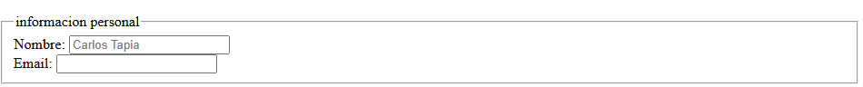
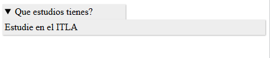

# 📘 HTML

HTML no es un lenguaje de programación; es un lenguaje de marcado que define la estructura de tu contenido. HTML consiste en una serie de elementos que usarás para encerrar diferentes partes del contenido para que se vean o comporten de una determinada manera

ejemplo:

```html
<p>hola mundo!</p>
```

la etiqueta `<p>` indica que esta parte semanticamente para la estructura html se trata de un parrafo.

Tambien es posible concatenar etiquetas, digase colocar una etiqueta dentro de otra.

ejemplo:

```html
<p>hola <strong>mundo!<strong></p>
```

Dentro del parrafo se anido una etiqueta strong para resaltar la palabra mundo!.

En html existen lo que son etiquetas vacias, estas son etiquetas que no necesitan envolver un contenido.

<hr>

## ✅ Estructura de un archivo HTML

```html
<!DOCTYPE html>
<html lang="es">
  <head>
    <meta charset="UTF-8" />
    <title>Mi Página</title>
  </head>
  <body>
    <!-- Aquí va el contenido -->
  </body>
</html>
```

Esta es la estructura base para crear una pagina web, a continuacion desglozamos cada una de las etiquetas utilizadas:

```html
<!DOCTYPE html>
```

Este elemento a dia de hoy solo es utilizado como buena practica, es necesario colocarlo, anteriormente esta etiqueca cargaba un conjunto de reglas que un documneto debia seguir.

```html
<html lang="es">
  ...
</html>
```

La etiqueta html es la etiqueta raiz, es donde va todo el contenido de la pagina, aqui vemos el atributo lang y su valor representa el idioma principal del documento.

```html
<head>
  ...
</head>
```

Esta etiqueta contiene todo lo que no es visible en la pagina pero si importante para la pagina, se suele incluir las keywords, una descripción de la página que quieres que aparezca en resultados de búsquedas, etc...

```html
<meta charset="UTF-8" />
```

La etiqueta `<meta>` en HTML sirve para proporcionar información sobre una página web, que no es visible para el usuario, pero que los motores de búsqueda y navegadores pueden usar para interpretar y mostrar la página correctamente. En este caso, el atributo charset especifica que el conjunto de caracteres del documento es UTF-8, lo cual es importante para que el navegador interprete correctamente el texto, especialmente si contiene símbolos especiales o letras con acentos. Este valor (UTF-8) es ampliamente recomendado por su compatibilidad internacional.

```html
<title></title>
```

Establece como su nombre indica el titulo de la pagina, es lo qeu aparece en la pestaña del navegador.


```html
<body></body>
```

Al contrario de la etiqueta head, la etiqueta body encierra todo el contenido que semuestra al usuario al ingresar al sitio web.

<hr>

## Metadatos

Son en su definición más simple, datos que describen otros datos. Por ejemplo: datos sobre el HTML, como quién lo escribió y palabras claves importantes que describen el documento, para definirlos en html se utiliza la etiqueta `<meta>` como vimos anteriormente.

otro de los tipos de metadatos que mas se utilizan estan los que incluyen atributos de `name` y `content`:

- `name` Indica el tipo de metadato a tratar, o que tipo de informacion contiene
- `content` indica el contenido valga la redundancia.

Ejemplo:

```html
<meta name="author" content="Carlos Tapia" />
<meta
  name="description"
  content="💻 Desarrollador en constante aprendizaje | 🌱Apasionado por resolver problemas con código | 🚀 Construyendo mi camino hacia el éxito"
/>
```

Aqui vemos el metadato `author` que indica el creador de la pagina y seguidos del `description` que provee una breve descripcion del sitio, esta es la informacion que sale en los motores de busqueda (el agregar esta informacion es buena practica para la optimizacion de los motores de busqueda).

los favicons

```html
<link rel="shortcut icon" href="favicon.ico" type="image/x-icon" />
```

Son una forma de ampliar y personalizar mas el diseño de tu sitio o pagina web, estos son las pequeñas imagenes que aparecen en la pestaña del navegador.


Además de las etiquetas `<meta>`, el elemento `<head>` también incluye otros recursos importantes como:

- `<link>` para enlazar archivos externos, como hojas de estilo CSS. Estos enlaces son considerados metadatos porque describen recursos relacionados con el documento.

Ejemplo de como enlazarlo en el head en html:

```html
<link rel="stylesheet" href="Style.css" />
```

- `<script>` para incluir o enlazar archivos JavaScript, que añaden funcionalidad al sitio web, aunque no son metadatos como tal.

Ejemplo de como enlazarlo en el head en html:

```html
<script src="archivo.js"></script>
```

<hr>

## Etiquetas básicas HTML

**Los encabezados:**

```html
<h1>Mi título principal</h1>
<h2>Mi título de nivel superior</h2>
<h3>Mi subtítulo</h3>
<h4>Mi sub-subtítulo</h4>
<h5>...</h5>
<h6>...</h6>
```

Nos ayudan a identificar partes o secciones en nuestra pagina web, asi como un libro tiene titulo y subtitulos por capitulo, de la misma manera se puede asignar importancia a las partes de nuestra pagina, aunque existen 6 niveles mayormente solo se utiliza hasta el nivel 3 o 4.

💡 **TIP:**
Solo debe haber un solo h1 por pagina, este debe representar el contenido principal de la pagina dado que es tambien usado por el SEO para mostrar nuestro contenido.

Ejemplo: si tu sitio web trata de cocinas o recetas el h1 debe hacer alucion a esto para que pueda ser identificado facilmente.

**Parrafos:**

```html
<p></p>
```

ya la vimos antes, esta etiqueta define un parrafo en nuestro contenido.

**Enlaces:**

```html
<a href="">Esto es un vinculo</a>
```

Estos son los vinculos o enlaces los que le dan la importancia a la web permitiendo conectar contenidos ya sean internos o externos, para externos en el atributo href se coloca la ruta del sitio al cual quieres visitar.

si es interno se crea en la etiqueta que representa la seccion un atributo id ejemplo: `<h2 id="Estudios">Estudios</h2>` y en el enlace se referencia de la siguiente forma `<a href="#Estudios">`

**Imagenes:**

```html

```

Tambien podemos agregar imagenes a nuestra pagina web mediante la etiqueta `` la cual conta de dos atributos el `src` mediante el cual se indica la ruta (_ya sea absoluta o relativa_) de donde se encuentra la imagen y el atributo `alt` el cual en dado caso la imagen no se encuentre o por algun motivo esta no se pueda mostrar en su lugar indicara el texto alternativo (considerado una buena practica de acesibilidad).

**Listas:**

```html
<ul>
  <li></li>
</ul>
```

Las unorder list o listas desordenas, como su nombre indica son las lista sin importancia jerárquica.

```html
<ol>
  <li></li>
</ol>
```

Al contrario de las ul estas son listas ordenadas donde el orden si tiene importancia

En ambas primero se define el tipo por la eticata `<ol>` ó `<ul>` y luego se definen los elementos de la lista en los (_list item_) `<li>`

**Saltos de lineas:**

```html
<br />
```

Dado que todo el texto que ponemos en nuestro html no viene estructurado y los espacios o saltos de lineas que damos al texto escrito no son tomados en cuenta para ayudarnos en los saltos de lineas utilizamos la etiqueta `<br>` la cual hace que el contenido despues de la etiqueta inicie en una nueva linea.

**Tablas:**

```html
<table>
  <thead>
    <tr>
      <th>Encabezado</th>
    </tr>
  </thead>
  <tbody>
    <tr>
      <td>Dato</td>
    </tr>
  </tbody>
  <tfoot>
    <tr>
      <td>Pie de tabla</td>
    </tr>
  </tfoot>
</table>
```

las tablas son uno de los fuertes de html ya que nos permiten mostras los datos de una mejor manera.

la etiqueta base que estructura la tabla es `<table>`, seguido de un `<tr>` para indicar la fila y luego para la cabecera utilizamos `<th>` para identificar el encabezado.

para el cuerpo donde estaran los datos a los que hace referencia el encabezado utilizamos `<tbody>` seguido de nueva vez `<tr>` que indica la fila y el `<td>` es el campo a llenar, este mismo esquema sera para el footer de la tabla (útil para totales o notas).

💡 **Importante:**
Mejora la accesibilidad en tablas con `scope`:

```html
<table>
  <thead>
    <tr>
      <th scope="col">Nombre</th>
      <!-- Indica que es encabezado de columna -->
      <th scope="col">Edad</th>
    </tr>
  </thead>
  <tbody>
    <tr>
      <td scope="row">Carlos</td>
      <!-- Encabezado de fila -->
      <td>25</td>
    </tr>
  </tbody>
</table>
```

Esto ayuda a lectores de pantalla (para usuarios con discapacidad visual).

**formularios**

```html
<form>
  <label for="nombre">Nombre:</label>
  <input type="text" id="nombre" name="nombre" />
  <button type="submit">Enviar</button>
</form>
```

Otro de los puntos fuertes de html, los formularios son los que nos permiten extraer informacion del usuario atravez de una serie de etiquetas.

la etiqueta `<form>` es la que estructura o encierra el formulario indicando su inicio y final y dentro de esta etiqueta se colocan todos los elementos a tratar.

**📤 Métodos de envío: GET vs POST**
El atributo `method` en `<form>` define cómo se envían los datos al servidor:

| Método | Uso                                                    | Ejemplo                              |
| ------ | ------------------------------------------------------ | ------------------------------------ |
| `GET`  | Datos visibles en la URL (para búsquedas).             | `form method="GET" action="/buscar"` |
| `POST` | Datos ocultos (para envíos seguros, como contraseñas). | `form method="POST" action="/login"` |

💡 **Importante:**

1. `GET` tiene límite de longitud (no usar para datos sensibles).
2. `POST` requiere procesamiento en el backend (como PHP o Node.js).

- _`<fieldset>`:_ Agrupa elementos relacionados dentro de un formulario.

```html
<fieldset>
  <legend>informacion personal</legend>
  <label for="name">Nombre:</label>
  <input
    type="text"
    id="name"
    name="name"
    placeholder="Carlos Tapia"
    required
  />

  <div>
    <label
      >Email:
      <input type="email" name="email" required />
    </label>
  </div>
</fieldset>
```

- \_`<legend>`:\_Título o descripción para el contenido de un `<fieldset>`.

```html
<legend>informacion personal</legend>
```



- _Labels:_ Esta etiqueta se utiliza para asociar un texto descriptivo a un campo de entrada de datos (como un `<input>`), mejorando la accesibilidad y la experiencia del usuario, especialmente para tecnologías de asistencia como lectores de pantalla.

```html
<label for="nombre">Nombre:</label> <input type="text" id="nombre" />
```

En el ejemplo, el atributo for="nombre" vincula la etiqueta `<label>` con el campo `<input>` cuyo `id` es "nombre", permitiendo que al hacer clic en el texto "Nombre:", el campo de entrada reciba el foco automáticamente.

💡 **TIP:**
También puedes envolver el campo directamente dentro del <label> si no usas el atributo for:

```html
<label>Nombre: <input type="text" /></label>
```

- _inputs:_ Esta etiqueta se utiliza para insertar campos interactivos en un formulario, permitiendo al usuario introducir diferentes tipos de datos, como texto, números, contraseñas, fechas, correos, y más. Es un elemento vacío (autocerrado) que se configura mediante el atributo `type`, Comúnmente usado con una etiqueta `<label>` para mejor accesibilidad.

```html
<input type="text" id="nombre" name="nombre" />
```

📋 Tipos de `<input>` en HTML

| Tipo (`type`) | Descripción                                                                  | Ejemplo                                              |
| ------------- | ---------------------------------------------------------------------------- | ---------------------------------------------------- |
| `text`        | Campo de texto de una sola línea.                                            | `<input type="text" />`                              |
| `password`    | Oculta los caracteres escritos, útil para contraseñas.                       | `<input type="password" />`                          |
| `email`       | Valida que el texto tenga formato de correo electrónico.                     | `<input type="email" />`                             |
| `number`      | Permite solo números (con botones de incremento).                            | `<input type="number" />`                            |
| `date`        | Muestra un selector de fecha.                                                | `<input type="date" />`                              |
| `time`        | Muestra un selector de hora.                                                 | `<input type="time" />`                              |
| `checkbox`    | Casilla para selección múltiple (sí/no).                                     | `<input type="checkbox" />`                          |
| `radio`       | Opción única dentro de un grupo de elecciones.                               | `<input type="radio" name="sexo" value="masculino">` |
| `file`        | Permite subir archivos.                                                      | `<input type="file" />`                              |
| `submit`      | Botón que envía el formulario.                                               | `<input type="submit" value="Enviar" />`             |
| `reset`       | Botón que reinicia los campos del formulario.                                | `<input type="reset" value="Limpiar" />`             |
| `button`      | Botón genérico sin función predeterminada (se usa con JavaScript).           | `<input type="button" value="Haz clic" />`           |
| `tel`         | Campo para números telefónicos.                                              | `<input type="tel" />`                               |
| `url`         | Campo que valida que el texto sea una URL.                                   | `<input type="url" />`                               |
| `color`       | Selector de color.                                                           | `<input type="color" />`                             |
| `range`       | Selector tipo barra deslizante para valores numéricos.                       | `<input type="range" min="0" max="100" />`           |
| `hidden`      | Campo oculto, no visible al usuario pero útil para enviar datos al servidor. | `<input type="hidden" value="12345" />`              |

- _Botones:_ Como su nombre indica esta etiqueta nos permite colocar botones en nuestra pagina o sitio web, y al igual que los input atravez del atributo type se le puede indicar el tipo de boton

```html
<button type="submit">Enviar</button>
```

al igual que con los input estos tienen diferentes funcionalidades por el tipo espesificado en el atributo `type` los cuales pueden ser:

1. _Submit:_ Envía el formulario. Es el valor predeterminado si no se especifica `type`.
2. _Reset:_ Reinicia todos los campos del formulario a sus valores iniciales.
3. _Button:_ Botón sin funcionalidad predeterminada. Se usa con JavaScript.

- \_`<select>` y `<option>`:\_Crea un menú desplegable con varias opciones

```html
<select>
  <option value="1">Uno</option>
  <option value="2">Dos</option>
</select>
```

- \_`<textarea>`:\_Campo de texto de varias líneas.

```html
<textarea rows="4" cols="50">Escribe aquí...</textarea>
```

```html
<div>...</div>
```

**✅ Validación de formularios en atributos HTML**

`required`
Descripción: Campo obligatorio, no se puede dejar vacío.

Ejemplo:

```html
<input type="text" required />
```

`min / max`
Descripción: Establece un valor mínimo y máximo para campos numéricos o de fecha.

Ejemplo:

```html
<input type="number" min="1" max="10" />
```

`pattern`
Descripción: Usa una expresión regular para validar el formato del texto.

Ejemplo:

```html
<input type="text" pattern="[A-Za-z]{3,}" title="Mínimo 3 letras" />
```

`placeholder`
Descripción: Texto que aparece dentro del campo como ejemplo o sugerencia.

Ejemplo:

```html
<input type="email" placeholder="correo@ejemplo.com" />
```

La etiqueta `<div>` es un contenedor generico este no tiene efecto sobre el contenido que encierra, solo sirve para separar el contenido y ayuda a dar estilo.

**`<span>` - Contenedor en línea**

```html
<p>Esto es un párrafo, <span>bla, bla, bla.</span></p>
```

al igual que el `<div>` la etiqueta `<span>` no tiene efecto sobre el contenido que encierra, solo son etiquetas de ayuda para estilizar el contenido.

**Comentarios**

```html
<!--Esto es un comentario-->
```

Esta es la forma de comentar un codigo en html

**Etiquetas de estilo visual o énfasis textual**
| Etiqueta | Descripción |
|------------|------------------------------------------------------------------------------|
| `<strong>` | Da **énfasis fuerte** al texto. Se ve en **negrita** por defecto. |
| `<em>` | Da **énfasis leve** al texto. Se ve en _cursiva_ por defecto. |
| `<b>` | Muestra el texto en **negrita**, pero sin énfasis semántico. |
| `<i>` | Muestra el texto en _cursiva_, pero sin semántica. |
| `<mark>` | Resalta el texto como si estuviera iluminado o subrayado. |
| `<small>` | Muestra el texto en un tamaño más pequeño. |
| `<sub>` | Muestra texto en subíndice (por debajo del texto base). |
| `<sup>` | Muestra texto en superíndice (por encima del texto base).

⚠️ **¡Importante!** Aunque estas etiquetas aplican estilo, lo ideal es usar CSS (font-weight, font-style, font-size, etc.) para controlar su presentación visual.

<hr>

## 🔵 Etiquetas Avanzadas y Semánticas en HTML

Las etiquetas semánticas en HTML5 permiten darle un significado estructural al contenido de una página web. A diferencia de las etiquetas genéricas como `<div>` o `<span>`, estas etiquetas describen claramente el propósito del contenido que encierran, facilitando la accesibilidad, el SEO, y el mantenimiento del código.

Tambien para aplicar estilos al contenido con CSS, o para que haga cosas interesantes con JavaScript, necesitas tener elementos que delimiten el contenido relevante para que CSS/JavaScript se puedan focalizar en este efectivamente.

🧱 Orden recomendado para la estructura de una página:

1. `<header>`

2. `<nav>`

3. `<main>`

4. Dentro de `<main>`:

   - `<section>`

   - `<article>`

   - `<aside>` (si aplica)

5. `<footer>`

esto nos ayuda a poder concretar la estructura de una pagina html5


**`<header>` – Encabezado**

```html
<header>
  Logo
  <nav>...</nav>
</header>
```

Es la parte superior de las páginas web de un sitio. En este se colocan los elementos más importantes de la navegación, como el menú principal; y los de la marca en sí, como el logo, los iconos de las redes sociales, etc

**`<nav>` – Navegación**

```html
<nav class="menu">
  <ul>
    <li><a href="#">Inicio</a></li>
    <li><a href="#">Sobre nosotros</a></li>
    <li><a href="#">Contacto</a></li>
  </ul>
</nav>
```

Representa una sección de una página cuyo propósito es proporcionar enlaces de navegación, ya sea dentro del documento actual o a otros documentos

**`<main>` – Contenido principal**

```html
<!DOCTYPE html>
<html>
  <head>
    <title>Mi página web</title>
  </head>
  <body>
    <header>
      <nav>
        <ul>
          <li><a href="#">Inicio</a></li>
          <li><a href="#">Acerca de</a></li>
          <li><a href="#">Contacto</a></li>
        </ul>
      </nav>
    </header>
    <main>
      <h1>Bienvenido a mi página web</h1>
      <p>Este es el contenido principal de mi página web</p>
    </main>
    <footer>
      <p>Copyright © 2025 Mi Página Web</p>
    </footer>
  </body>
</html>
```

Representa el contenido principal del <body> de un documento o aplicación. El área principal del contenido consiste en el contenido que está directamente relacionado, o se expande sobre el tema central de un documento o la funcionalidad central de una aplicación.

**`<section>` – Sección de contenido**

```html
<section>
  <h2>Ofertas</h2>
  <p>Ofrecemos lo mejor...</p>
</section>
```

las secciones se utilizan para representar una sección o grupo de contenido relacionado dentro de un documento o aplicación

**`<article>` – Contenido independientee**

```html
<article id="intro">
  <header>
    <h2>Introducción al artículo</h2>
  </header>
  <p>
    Este es un artículo de ejemplo que muestra cómo utilizar la etiqueta article
    en HTML5.
  </p>
</article>
```

la etiqueta `<article>` se utiliza para definir contenido independiente y autocontenido, como un post de blog, un artículo de noticias o una entrada de diario.

**`<aside>` – Contenido lateral o secundario**

```html
<body>
  <main>
    <p>Este es el contenido principal de la página.</p>
  </main>
  <aside>
    <p>Este es el contenido secundario de la página.</p>
  </aside>
</body>
```

Representa una sección de contenido que está indirectamente relacionada con el contenido principal de una página. Esta sección puede contener información complementaria, como glosarios, bibliografías, citas destacadas, barras laterales, o incluso anuncios.

**`<footer>` – Pie de página**

```html
<footer>
  :copyright @ 2025- Carlos Jashier Tapia
  <br />
  <a href="mailto:carlosjtapia12798@hotmail.com"> Enviame un correo </a> <br />
  <a href="tel:+18098673792"> Llamame </a>
</footer>
```

Es el pie de página de una sección o página web. Este pie de página suele contener información como derechos de autor, datos de contacto, enlaces relevantes o información adicional para el usuario.

**`<figure>` y `<figcaption>` – Imagen con pie**

```html
<figure>
  
  <figcaption>Adrable gatito comiendo</figcaption>
</figure>
```

Permite agregar contenido variado asociadas a una descripción o título, el cual es asociado semánticamente a este, de tal forma que podemos agregar una imagen, ilustración, diagrama, o incluso código.

`<figure>` no es mas que un contenedor para imágenes o gráficos, y `<figcaption>` representa un subtítulo o leyenda asociado al contenido del elemento padre `<figure>`

**`<details>` y `<summary>` – Sección desplegable**

```html
<section>
  <h3>Preguntas frecuentes</h3>

  <details>
    <summary>Que estudios tienes?</summary>
    <p>Estudie en el ITLA</p>
  </details>

  <details>
    <summary>Cuales son tus hobbies</summary>
    <p>
      Me gusta la musica, el deporte y la vida fit, el anime y los videojuegos
      pero lo que mas me gusta es aprender y mas si es programacions
    </p>
  </details>
</section>
```

`<details>` es usado como un widget de revelación a través del cual el usuario puede obtener información adicional y `<summary>` especifica un resumen, un título o una leyenda para el cuadro de divulgación de un `<details>`. Al hacer clic en el `<details>`, el elemento principal alterna entre abierto y cerrado.

Es util para la seccion de preguntas frecuentes



**Contenido multimedia**

**🎥 Etiqueta `<video>`** permite incrustar contenido de video en una página web. A continuación, un ejemplo con varios atributos útiles:

```html
<video
  controls
  width="400"
  height="400"
  autoplay
  loop
  muted
  poster="poster.png"
>
  <source src="rabbit320.mp4" type="video/mp4" />
  <source src="rabbit320.webm" type="video/webm" />
  <p>
    Su navegador no soporta vídeo HTML5. Este es un
    <a href="rabbit320.mp4">enlace al vídeo</a> alternativo.
  </p>
</video>
```

_🧩 Atributos principales de `<video>`_

| **Atributo**       | **Descripción**                                                                                                             |
| ------------------ | --------------------------------------------------------------------------------------------------------------------------- |
| `controls`         | Muestra los controles predeterminados del reproductor (play, volumen, etc.).                                                |
| `width` / `height` | Define el tamaño del reproductor. El video mantiene su proporción nativa. Si se distorsiona, se rellena con color de fondo. |
| `autoplay`         | Inicia la reproducción automática al cargar la página. ⚠️ No se recomienda por usabilidad.                                  |
| `loop`             | Reproduce el video de forma continua cada vez que finaliza. Úsalo con moderación.                                           |
| `muted`            | Inicia el video sin sonido. Útil cuando se usa junto con `autoplay`.                                                        |
| `poster`           | Imagen que se muestra antes de que el video comience a reproducirse (miniatura o portada).                                  |
| `preload`          | Define cómo debe cargarse el video antes de reproducirse. Valores: `none`, `auto`, `metadata`.                              |

_🔍 Valores de `preload`_

| **Valor**  | **Comportamiento**                                      |
| ---------- | ------------------------------------------------------- |
| `none`     | No carga nada hasta que el usuario lo solicite.         |
| `metadata` | Carga solo los metadatos (duración, dimensiones, etc.). |
| `auto`     | Intenta cargar el video completo automáticamente.       |

**🔊 Etiqueta `<audio>`** permite insertar contenido de audio en una página web, como música o efectos de sonido.

```html
<audio controls preload="auto" autoplay loop muted>
  <source src="audio-ejemplo.mp3" type="audio/mpeg" />
  <source src="audio-ejemplo.ogg" type="audio/ogg" />
  Tu navegador no soporta el elemento de audio.
</audio>
```

Los atributos son iguales a los de la etiqueta `<video>` exceptuando `poster`, `width` y `height`.

**Otras etiquetas semánticas o estructurales**

| Etiqueta       | Descripción                                                              |
| -------------- | ------------------------------------------------------------------------ |
| `<time>`       | Representa una fecha u hora. Puede incluir el atributo `datetime`.       |
| `<hr>`         | Inserta una línea horizontal para separar secciones de contenido.        |
| `<blockquote>` | Representa una cita en bloque de otra fuente.                            |
| `<pre>`        | Muestra texto preformateado, respetando espacios y saltos de línea.      |
| `<abbr>`       | Representa una abreviatura. Usualmente se usa con el atributo `title`.   |
| `<code>`       | Indica fragmentos de código fuente, con fuente monoespaciada.            |
| `<cite>`       | Se usa para citar títulos de obras (libros, artículos, películas, etc.). |

<hr>

## 🎯 Atributos Globales

Los atributos globales son atributos que se pueden usar en casi cualquier elemento HTML. Permiten identificar, estilizar o dar comportamiento adicional a los elementos.

`id`
Descripción: Identificador único de un elemento. Se usa para referenciar desde CSS o JavaScript.

Ejemplo:

```html
<p id="parrafo1">Hola mundo</p>
```

`class`
Descripción: Permite asignar uno o varios nombres de clase a un elemento para aplicar estilos o comportamientos.

Ejemplo:

```html
<div class="caja sombra">Contenido</div>
```

`style`
Descripción: Aplica estilos CSS directamente en línea (no recomendado para mantener el código limpio).

Ejemplo:

```html
<p style="color: red;">Texto rojo</p>
```

`title`
Descripción: Muestra un texto al pasar el mouse por encima del elemento.

Ejemplo:

```html
<abbr title="Organización Mundial de la Salud">OMS</abbr>
```

`data-\*`
Descripción: Permite almacenar información personalizada en el HTML (muy útil con JavaScript).

Ejemplo:

`````html
<button data-producto-id="123">Agregar al carrito</button>

`hidden```` Descripción: Oculta el elemento visualmente (no se muestra en la
página). Ejemplo: ```html
<div hidden>Este contenido está oculto</div>
`````

`contenteditable`
Descripción: Permite que el contenido del elemento sea editable por el usuario.

Ejemplo:

```html
<p contenteditable="true">Puedes editar este texto</p>
```

`tabindex`
Descripción: Controla el orden en que los elementos reciben el foco al navegar con la tecla Tab.

Ejemplo:

```html
<input type="text" tabindex="2" /> <input type="text" tabindex="1" />
```

<hr>

## 🔤 Entidades HTML

Las entidades HTML permiten representar caracteres especiales que podrían confundirse con código HTML o que no se pueden escribir fácilmente.

| Entidad  | Resultado | Descripción                                           |
| -------- | --------- | ----------------------------------------------------- |
| `&nbsp;` |           | Espacio no separable (no se rompe en una nueva línea) |
| `&lt;`   | <         | Menor que                                             |
| `&gt;`   | >         | Mayor que                                             |
| `&amp;`  | &         | Ampersand (símbolo &)                                 |
| `&quot;` | "         | Comillas dobles                                       |
| `&apos;` | '         | Comillas simples                                      |
| `&copy;` | ©         | Símbolo de copyright                                  |
| `&reg;`  | ®         | Marca registrada                                      |
| `&euro;` | €         | Símbolo del euro                                      |
| `&cent;` | ¢         | Símbolo de centavo                                    |
| `&yen;`  | ¥         | Símbolo del yen japonés                               |

Ejemplo:

```html
<p>El símbolo de menor que se escribe así: &lt;</p>
<p>&copy; 2025 Carlos Tapia</p>
```

## 🛠️ Recursos útiles

### Validación de HTML

Antes de publicar tu página, valida que el código HTML sea correcto usando:

- **[Validador W3C](https://validator.w3.org/):** Revisa errores de sintaxis o etiquetas mal cerradas.
- **Extensión VS Code:** _HTMLHint_ (para detectar errores mientras programas).

Ejemplo de error común:

```html
<p>Hola <strong>mundo!</p> <!-- Error: etiqueta <strong> no cerrada -->
```

_Actualizado por Carlos Tapia._
